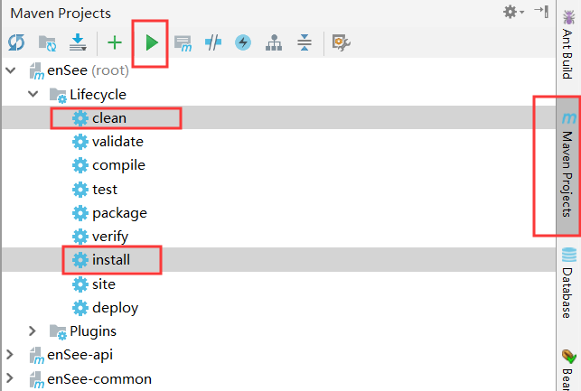
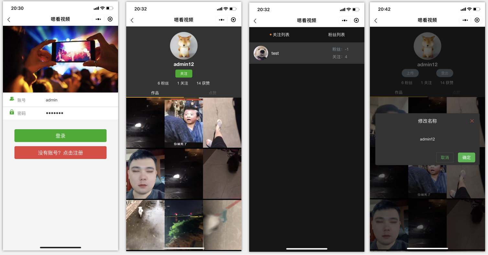
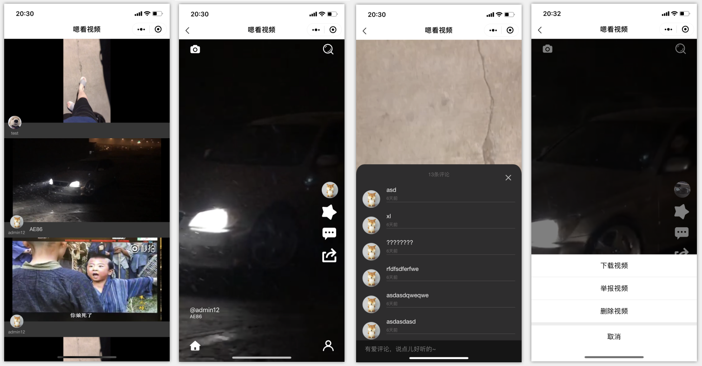
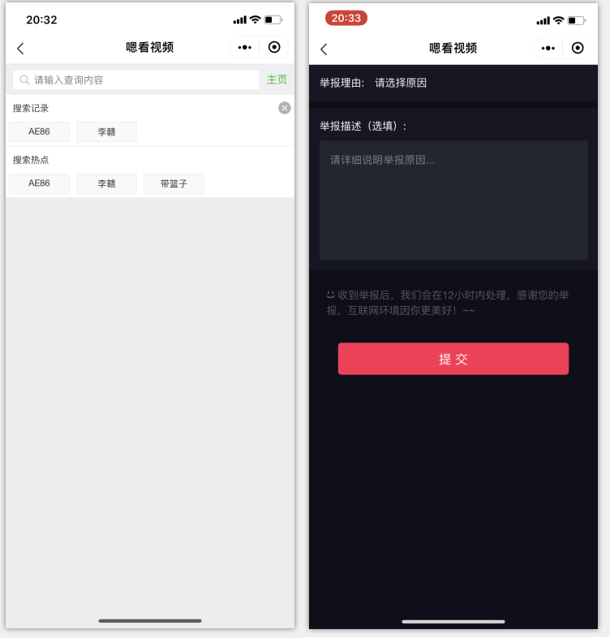

## 嗯看视频小程序

### 一、小程序端

小程序端的配置比较简单，只需修改`app.js`

```js
App({
  serverUrl: "http://192.168.0.104:8008",
  //serverUrl: "http://localhost:8008",
    
    ···
}
```

改为自己服务器地址

### 二、后端

#### 使用技术：

- Springboot
- Mybatis
- redis
- ffmpeg
- swagger2
- zookeeper

#### 需要环境：

- redis环境
- ffmpeg：直接去官网下载<http://ffmpeg.org/>

#### 需要修改的配置：

1.`application.properties`（api modual下）

```properties
#修改redis配置
spring.redis.host=192.168.1.209
spring.redis.port=6379
spring.redis.password=xxx

#修改数据库信息
spring.datasource.url=jdbc:mysql://localhost:3306/ensee-dev?useUnicode=true&characterEncoding=utf8
spring.datasource.username=root
spring.datasource.password=root
```

2.修改`BasicController`（api modual下）

将`FILE_SPACE`修改为你想保存的路径，`FFMPEG_PATH`修改为ffmpeg的保存路径

3.`zookeeper`的配置

本来zookeeper的配置在`resource.properties`，但是因为zk是配合后台对bgm进行同步添加删除使用的；

又因为后台项目不会放出（简单的模板配合CRUD），所以可以直接将`WebMvcConfig`类中对`ZKCuratorClient`的注入给**注释掉**即可

```java
/*@Bean(initMethod = "init")
    public ZKCuratorClient zkCuratorClient(){
        return new ZKCuratorClient();
    }*/
```

#### 项目的启动：

对主程序进行`clean install`



直接运行`MainApplication`主程序类

有问题联系我：8709867

## 项目功能与界面

##### 用户模块

登录注册，个人中心，更换头像与昵称，个人作品列表，喜欢的作品列表，关注粉丝列表，取消关注与关注



##### 视频模块

主页分页展示视频，视频详情页面，举报视频，视频点赞与评论，删除视频，下载视频



##### 搜索模块

搜索视频，（因排版问题，举报视频界面放到一起了）



##### BGM模块

上传视频并选择BGM合并


## 最后

本来想部署上线的，结果**微信小程序必须域名备案**（需要耽误一段时间），再加上**服务器只有1m带宽**，测试了一下卡的批爆，还是算了，以后有更好的项目在上线，这只是一个springboot的玩具